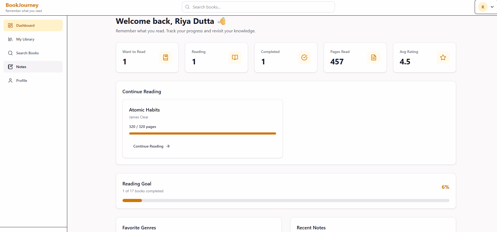
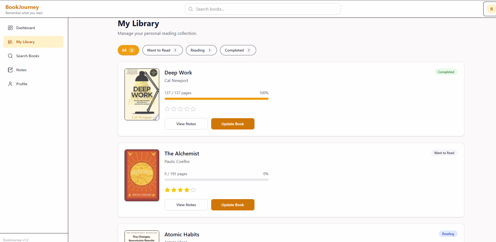
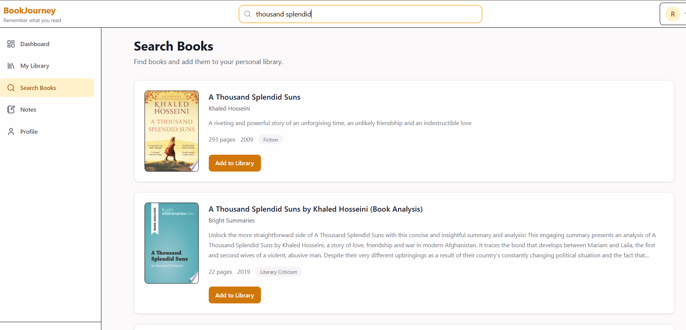
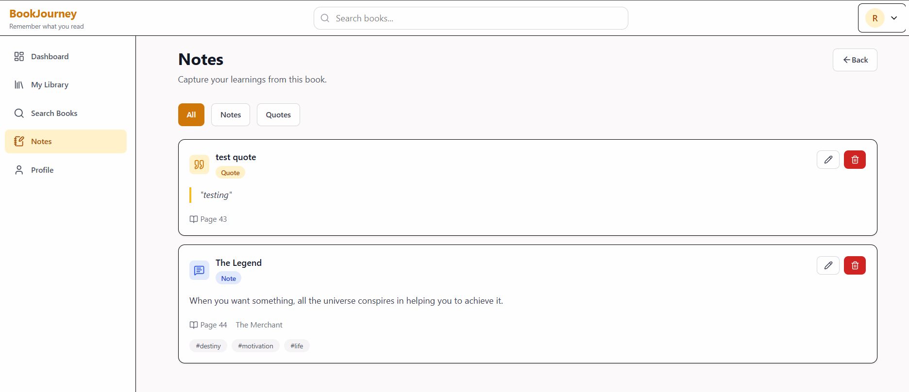

# 📚 BookJourney

> **Remember what you read.**

BookJourney is a full-stack personal knowledge management platform that helps readers organize their books, track reading progress, capture notes and quotes, and revisit key insights—all in one place.

Unlike traditional book trackers, BookJourney focuses on helping users retain knowledge rather than simply recording finished books.

---

## 📸 Screenshots

Dashboard


My Library 


Search


Notes / Quotes



---

# ✨ Features

## 🔐 Authentication

- User Registration
- User Login
- JWT Authentication
- Protected Routes
- Password Hashing with bcrypt
- Update Profile
- Change Password

---

## 📚 Book Discovery

- Search books using Google Books API
- View detailed book information
- Add books to personal library
- Prevent duplicate books in library

---

## 📖 Personal Library

- Organize books by status:
  - Want to Read
  - Reading
  - Completed
- Update reading progress
- Reading timeline
  - Started Date
  - Last Read Date
  - Completed Date
- Optional book rating
- Reading progress visualization
- Library filters

---

## 📝 Notes & Quotes

- Create Notes
- Create Quotes
- Edit Notes & Quotes
- Delete Notes & Quotes
- View all notes
- View notes for a specific book
- Add tags
- Page numbers
- Chapter information

---

## 📊 Dashboard

Personalized reading insights including:

- Books Currently Reading
- Completed Books
- Want to Read Books
- Total Pages Read
- Average Rating
- Reading Goal Progress
- Continue Reading
- Favorite Genres
- Recent Notes

---

## 👤 Profile

- Update Name
- Reading Goal
- Change Password
- Secure account management

---

# 🏗️ Project Structure

```
BookJourney/
│
├── backend/
│   ├── src/
│   │
│   ├── config/
│   ├── constants/
│   ├── controllers/
│   ├── middleware/
│   ├── models/
│   ├── routes/
│   ├── services/
│   ├── utils/
│   ├── validators/
│   │
│   ├── app.js
│   └── server.js
│
├── frontend/
│   ├── src/
│   │
│   ├── components/
│   ├── pages/
│   ├── hooks/
│   ├── services/
│   ├── layouts/
│   ├── context/
│   ├── constants/
│   ├── utils/
│   └── routes/
│
└── README.md
```

---

# 🛠 Tech Stack

## Frontend

- React 19
- React Router
- Context API
- Axios
- Tailwind CSS
- React Hot Toast
- Lucide React
- Vite

---

## Backend

- Node.js
- Express.js
- MongoDB Atlas
- Mongoose
- JWT Authentication
- bcrypt
- express-validator
- Axios

---

## Third-Party APIs

### Google Books API

BookJourney automatically fetches:

- Title
- Authors
- Cover Image
- Description
- Categories
- Publisher
- Published Date
- Page Count

---

# 📦 Database Design

## User

```
name
email
password
readingGoal
timestamps
```

---

## Book

```
googleBookId
title
authors
description
coverImage
pageCount
categories
publisher
publishedDate
timestamps
```

---

## UserBook

```
user
book
status
currentPage
rating
startedOn
completedOn
lastReadOn
timestamps
```

---

## Note

```
user
book
type
title
content
page
chapter
tags
timestamps
```

---

# 📡 REST APIs

## Authentication

| Method | Endpoint |
|---------|----------|
| POST | /api/auth/register |
| POST | /api/auth/login |
| GET | /api/auth/me |
| PATCH | /api/auth/profile |
| PATCH | /api/auth/change-password |

---

## Books

| Method | Endpoint |
|---------|----------|
| GET | /api/books/search |
| GET | /api/books/:googleBookId |
| POST | /api/books |
| GET | /api/books/library |
| PATCH | /api/books/library/:userBookId |

---

## Notes

| Method | Endpoint |
|---------|----------|
| POST | /api/notes |
| GET | /api/notes |
| PATCH | /api/notes/:noteId |
| DELETE | /api/notes/:noteId |

---

## Dashboard

| Method | Endpoint |
|---------|----------|
| GET | /api/dashboard |

---

# 🔒 Security

- JWT Authentication
- Protected Routes
- Password Hashing
- Request Validation
- Authorization Middleware
- Ownership Validation
- Duplicate Book Prevention
- Centralized Error Handling

---

# 🧠 Concepts Demonstrated

- REST API Design
- Layered Architecture
- Authentication & Authorization
- MongoDB Relationships
- MongoDB Aggregation
- Business Logic Separation
- React Component Architecture
- Context API
- Custom Hooks
- Third-Party API Integration
- Form Validation
- Responsive Design
- Accessibility
- Error Handling
- Reusable Components

---

# 🚀 Future Enhancements

- Advanced Note Search
- Reading Streaks
- Reading Statistics
- Bookmarks & Highlights
- AI Note Summaries
- Book Recommendations
- Export Notes (PDF/Markdown)
- Dark Mode
- Pagination
- Unit & Integration Testing
- Docker Support
- CI/CD Pipeline
- Progressive Web App (PWA)

---

# 💡 Why BookJourney?

Many readers finish books but forget most of what they learned.

BookJourney was built to solve this problem by combining reading progress with structured notes and quotes, creating a personal knowledge base that users can revisit anytime.

Its goal is simple:

> **Remember what you read.**

---

# 👩‍💻 Author

**Harmandeep Kaur**

